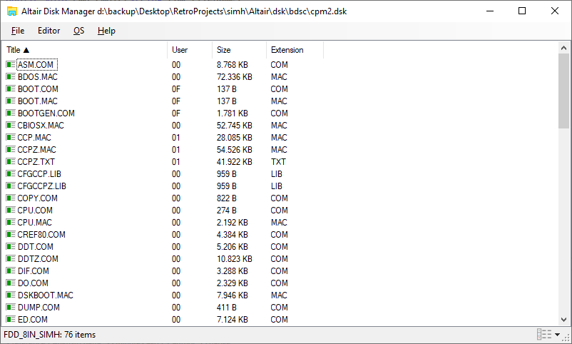
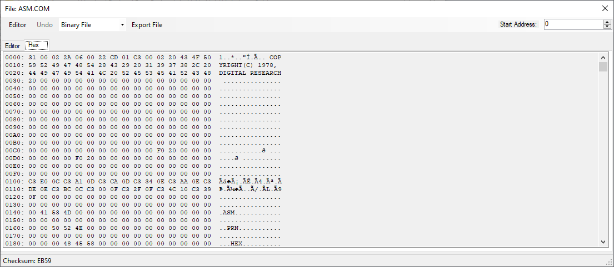
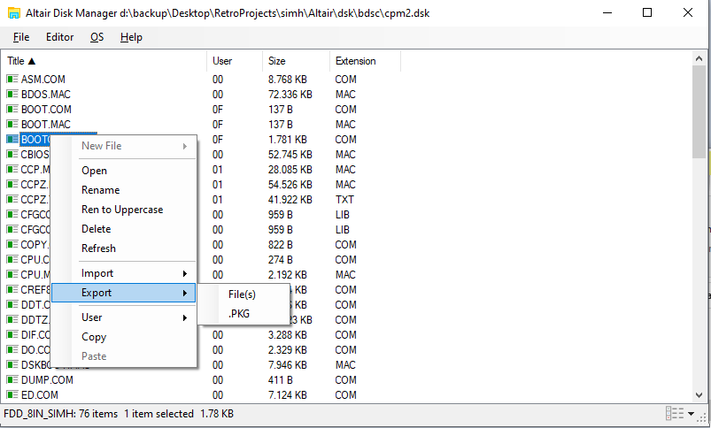

# Altair Disk Manager 

This uses a AltairTools.c implementation in C# to allow many disk formats to original [CP/M Disk Manager](https://github.com/abaffa/cpm_disk_manager)

CP/M disk manager offers a Windows GUI to manage CP/M disk format for homebrew projects like 64MB/128MB Compact Flash proposed by Grant Searle and RomWBW.
 
It's started as a tool to projects like CP/M on breadboard by Grant Searle (http://searle.x10host.com/cpm/index.html) and RC2014 by Spencer Owen (https://rc2014.co.uk/)

I use it in my personal project called [Baffa-2 Homebrew Microcomputer](https://baffa-2.baffasoft.com.br) and altairtools.c will help with the task of transferring files between different formats and managing disk images.

File data.dsk is an example of disk image.

To read the CFCard/SDCard it's necessary to run as administrator to have disk raw access priviledges. 

PS: This program uses the RawDiskLib.dll from Visual Studio 2017 to access (read/write) raw data from removable disks. As it has that raw disk access feature, some antivirus programs are erroneously reporting it as malware. This is a false positive and should be ignored! Btw the raw disk access only is available and accessible if the program is run with administrative privileges.

	

-----BEGIN LICENSE NOTICE----- 

MIT License

C# Altair Disk Manager Copyright (C) 2021  Augusto Baffa, (cpm.baffasoft.com.br)
Original Altair Tools Copyright (c) 2023 phatchman

Permission is hereby granted, free of charge, to any person obtaining a copy
of this software and associated documentation files (the "Software"), to deal
in the Software without restriction, including without limitation the rights
to use, copy, modify, merge, publish, distribute, sublicense, and/or sell
copies of the Software, and to permit persons to whom the Software is
furnished to do so, subject to the following conditions:

The above copyright notice and this permission notice shall be included in all
copies or substantial portions of the Software.

THE SOFTWARE IS PROVIDED "AS IS", WITHOUT WARRANTY OF ANY KIND, EXPRESS OR
IMPLIED, INCLUDING BUT NOT LIMITED TO THE WARRANTIES OF MERCHANTABILITY,
FITNESS FOR A PARTICULAR PURPOSE AND NONINFRINGEMENT. IN NO EVENT SHALL THE
AUTHORS OR COPYRIGHT HOLDERS BE LIABLE FOR ANY CLAIM, DAMAGES OR OTHER
LIABILITY, WHETHER IN AN ACTION OF CONTRACT, TORT OR OTHERWISE, ARISING FROM,
OUT OF OR IN CONNECTION WITH THE SOFTWARE OR THE USE OR OTHER DEALINGS IN THE
SOFTWARE.

-----END LICENSE NOTICE----- 
